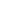

 

  <h3 align="center">Common data structures</h3>

  

    Description of common data structures
     
     
    <a href="https://github.com/pallandir/dsa-algorithms/issues">Report Bug</a>
    ·
    <a href="https://github.com/pallandir/dsa-algorithms/issues">Request Feature</a>
  

## Array

**Description:** An array is a contiguous collection of elements of the same type indexed by integers.  
**Use cases:** Used to store sequential data.  
**Common operations:** 
 - Access by index O(1)
 - Insert / Delete at end O(1)
 - Insert at specific index O(n)  
**Space complexity:** O(n)

## Linked list 

**Description:** A linked list is a A sequence of nodes, each containing data and a pointer to the next (and possibly previous) node.  
**Use case:** Efficient insertions/deletions at the beginning or middle. No need for resizing like arrays. 
**Common operations:** 
 - Access by index O(n)
 - Insert / Delete at head O(1)
 - Insert at middle O(n)  
**Space complexity:** O(n)

## Stack 

**Description:** A linear data structure that follows LIFO (Last In First Out).  
**Use case:** Useful for undo operations, syntax parsing, backtracking, and expression evaluation. 
**Common operations:** 
 - Push O(1)  
 - Pop O(1)
 - Peak O(1)  
**Space complexity:** O(n)

## Queue 

**Description:** A linear structure that follows FIFO (First In First Out). 
**Use case:** Models real-world queues; used in scheduling, BFS, and resource sharing. 
**Common operations:** 
 - Enqueue O(1)  
 - Dequeue O(1)
 - Peak O(1)  
**Space complexity:** O(n)

